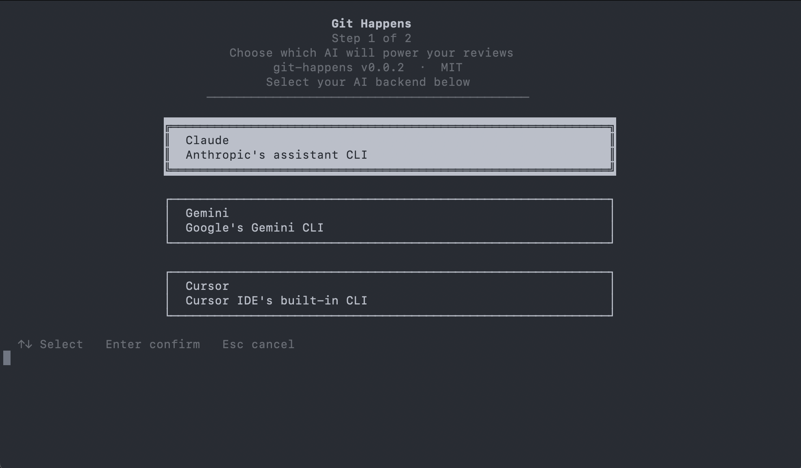

# Git Happens

**AI-powered PR reviews from your terminal.** Pick a pull request, run it
through Claude (or Gemini, Cursor, Codex), and post a draft review to
GitHub—then polish and submit in the browser.



No new APIs or keys. Git Happens uses the AI CLI you already have: it sends the
PR diff to your chosen assistant and turns the response into a proper GitHub
review with a body and inline comments.

---

## What you need

- **[GitHub CLI](https://cli.github.com/)** (`gh`) — installed and logged in
  (`gh auth login`).
- **One AI CLI** — [Claude](https://claude.ai/install),
  [Gemini](https://github.com/google-gemini/gemini-cli),
  [Cursor](https://cursor.com) (uses `agent`), or
  [OpenAI Codex](https://github.com/openai/codex). At startup, Git Happens
  checks which ones you have and lets you pick.

No API keys in this app. Your AI CLI handles auth and model choice; Git Happens
just feeds it the diff and formats the reply for GitHub.

---

## Install

**macOS / Linux (Homebrew):**

```bash
brew tap dvarka/git-happens
brew install git-happens
```

One-time tap, then install. Run `git-happens` from any directory.

---

## Upgrade

To get the latest release:

```bash
brew update && brew upgrade git-happens
```

`brew update` refreshes the formula; `brew upgrade` installs the new version.

---

## What it does

1. **Lists your PRs** — Assigned to you, review-requested, and your own open
   PRs, with a simple filterable list.
2. **You pick one** — Arrow keys, type to filter, Enter to choose.
3. **AI reviews the diff** — Sends the full diff + instructions to your chosen
   CLI; you see a spinner while it runs.
4. **Draft review** — The app posts a _draft_ review (body + inline comments)
   and opens the PR in your browser. You edit if you want, then click **Submit
   review**.

So: **draft in the terminal, finalize in the browser.** No accidental submits
from the CLI.

You can also run **AI PR Fixes**: list your PRs that have review feedback, then
(from the repo) generate a plan + patch to address comments. The tool never
commits or pushes—it only suggests changes.

---

## Quick start

```bash
git-happens
```

You’ll see a short setup check (gh + which AI CLIs are available), then either a
choice of AI or a single backend. Pick **AI PR Review**, choose a PR from the
list, and wait for the AI. When the draft is posted, the PR opens in your
browser—tweak and submit there.

---

## Options

- **`git-happens --version`** — Print version and exit.

---

## For Contributors

Hooks are in `.githooks/`. To run `deno fmt --check` before each commit (and
block the commit if not formatted), enable them once:

```bash
git config core.hooksPath .githooks
```

---

## License

[MIT](LICENSE).
